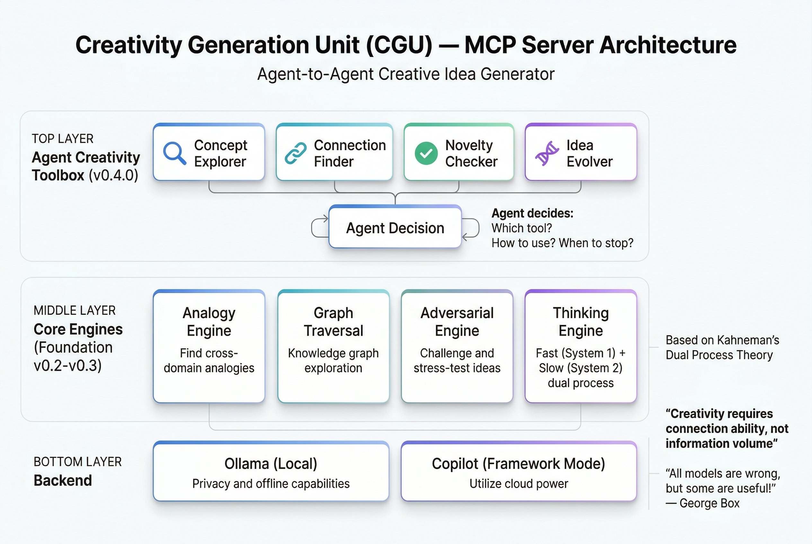

# Creativity Generation Unit (CGU)

> 🎨 **MCP-based Agent-to-Agent Creative Idea Generator**
> 
> 基於快思慢想 (Thinking, Fast and Slow) 的創意發想服務

[](https://opensource.org/licenses/Apache-2.0)
[](https://www.python.org/)

🌐 [繁體中文](README.zh-TW.md)

## 💡 Core Insight

> **"All models are wrong, but some are useful!"** — George Box

**Key Discovery: Creativity can emerge from partial information!**

- Humans don't need complete world knowledge to generate creative ideas
- Creativity requires **connection ability**, not information volume
- Even the simplest models can provide unique creative perspectives

## 🏗️ Architecture

<p align="center">
  
</p>

```
┌──────────────────────────────────────────────────────────────┐
│               Creativity Generation Unit (CGU)                │
│                        MCP Server                             │
├──────────────────────────────────────────────────────────────┤
│                                                               │
│   ┌─────────────────────────────────────────────────────┐   │
│   │       🧠 v0.4.0: Agent-Driven Creativity                │   │
│   │                                                       │   │
│   │   ┌─────────────────────────────────────────────┐   │   │
│   │   │           Agent Creativity Toolbox              │   │   │
│   │   │  ┌─────────┐ ┌────────┐ ┌─────────┐ ┌──────┐ │   │   │
│   │   │  │ Concept │ │Connect-│ │ Novelty │ │ Idea │ │   │   │
│   │   │  │Explorer│ │  ion   │ │ Checker │ │Evolver│ │   │   │
│   │   │  │  🔍   │ │ Finder │ │   ✅    │ │  🧬  │ │   │   │
│   │   │  └─────────┘ └────────┘ └─────────┘ └──────┘ │   │   │
│   │   └─────────────────────────────────────────────┘   │   │
│   │                         │                               │   │
│   │   Agent decides:  ┌─────┴──────┐                      │   │
│   │   - Which tool?   │   Agent   │  ← Autonomous        │   │
│   │   - How to use?   │  Decision │    Exploration       │   │
│   │   - When to stop? └────────────┘                      │   │
│   └─────────────────────────────────────────────────────┘   │
│                                                               │
│   ┌─────────────────────────────────────────────────────┐   │
│   │        v0.2-v0.3: Core Engines (Foundation)           │   │
│   │  ┌─────────┐ ┌─────────┐ ┌──────────┐ ┌─────────┐ │   │
│   │  │ Analogy │ │  Graph  │ │Adversari-│ │Thinking │ │   │
│   │  │ Engine  │ │Traversal│ │al Engine │ │ Engine  │ │   │
│   │  └─────────┘ └─────────┘ └──────────┘ └─────────┘ │   │
│   └─────────────────────────────────────────────────────┘   │
│                                                               │
│   Backend: Ollama (Local) / Copilot (Framework Mode)         │
└──────────────────────────────────────────────────────────────┘
```

## 💡 Core Insight: Agent-Driven Creativity (v0.4.0)

> **"Copilot 內部觸碰不到，無論外層做什麼最終都是 Prompt 進去"**

**Key Shift**: From "Human-Agent Language Interaction" to "Agent Autonomous Tool Interaction"

| Traditional | Agent-Driven |
|-------------|---------------|
| We design the process | Agent designs its own process |
| Fixed methodology | Dynamic exploration strategy |
| Output cannot be verified | Tools can verify |
| One-shot generation | Iterative exploration |

## 🧠 Thinking, Fast and Slow

Based on Daniel Kahneman's theory:

| System | Speed | Characteristics | CGU Implementation |
|--------|-------|-----------------|-------------------|
| **System 1** | Fast ⚡ | Intuitive, automatic | `REACT`, `ASSOCIATE`, `PATTERN_MATCH` |
| **System 2** | Slow 🐢 | Deliberate, analytical | `ANALYZE`, `SYNTHESIZE`, `EVALUATE` |
| **Creative** | Mixed 🎨 | Breaking boundaries | `DIVERGE`, `CONVERGE`, `TRANSFORM` |

**Core Strategy**: Multiple fast steps + occasional slow steps = Efficient creativity

## 🎯 Creativity Levels

```
Level 1: Combinational (0.7-1.0 association)
└─ New combinations of known elements

Level 2: Exploratory (0.3-0.7 association)
└─ Exploring boundaries within existing rules

Level 3: Transformational (0.0-0.3 association)
└─ Breaking rules, creating new paradigms
```

## 📚 15 Human Creativity Methods

CGU implements structured creativity methods:

| Category | Methods |
|----------|---------|
| **Divergent** | Mind Map, Brainstorm, SCAMPER, Random Input |
| **Structural** | 9-Grid Mandala, Morphological Analysis, 5W2H, Fishbone |
| **Perspective** | Six Thinking Hats, Reverse Thinking, Analogy |
| **Process** | Double Diamond, Design Sprint, KJ Method, World Café |
| **Systematic** | TRIZ 40 Principles |

## 🛠️ Tech Stack

- **MCP SDK**: FastMCP for tool serving
- **Agent Orchestration**: LangGraph
- **Local Inference**: vLLM + Qwen 4B
- **Structured Output**: Pydantic + Instructor
- **Web Search**: DuckDuckGo Search

## 🚀 Quick Start

```bash
# Clone repository
git clone https://github.com/YOUR_USERNAME/creativity-generation-unit.git
cd creativity-generation-unit

# Setup environment (uv recommended)
uv venv
uv sync --all-extras

# Run MCP server
cgu-server

# Or use CLI
cgu generate "How to improve remote work productivity?"
```

## 📁 Project Structure

```
creativity-generation-unit/
├── src/cgu/
│   ├── core/           # Core engines (v2)
│   │   ├── analogy.py  # Cross-domain analogy
│   │   ├── graph.py    # Concept graph traversal
│   │   ├── adversarial.py # Adversarial evolution
│   │   └── creativity_core.py # Unified engine
│   ├── tools/          # Agent tools (v0.4)
│   │   └── creativity_tools.py # 5 creativity tools
│   ├── soup/           # Spark-Soup 創意湯 (v0.5 NEW) 🆕
│   │   └── spark_soup.py # Context Stuffing for Creativity
│   ├── agents/         # Multi-Agent system (v0.3)
│   ├── thinking/       # Thinking Engine (v0.3)
│   ├── graph/          # LangGraph definitions
│   ├── llm/            # LLM backends
│   └── server.py       # MCP Server
├── docs/               # Documentation
├── tests/              # Test suite
├── memory-bank/        # Project memory
└── pyproject.toml      # Dependencies
```

## 🔧 MCP Tools

```typescript
// Core Tools (v0.2)
generateIdeas(topic, creativityLevel, count)
sparkCollision(conceptA, conceptB)
associativeExpansion(seed, direction, depth)
applyMethod(method, input)

// Deep Thinking Tools (v0.3)
deepThink(topic, depth, mode)
multiAgentBrainstorm(topic, agents)
sparkCollisionDeep(conceptA, conceptB)

// Agent Creativity Tools (v0.4)
exploreConcept(concept)       // Search concept space
findConnection(a, b)          // Discover connections
checkNovelty(idea)            // Validate novelty
evolveIdea(idea, mutation)    // Mutate ideas
getProgress()                 // Track exploration

// Spark-Soup Tools (v0.5 NEW) 🆕
sparkSoupGenerate(topic)      // Assemble "creativity soup"
sparkSoupQuick(topic)         // Quick soup + idea generation
collectFragments(topic)       // Collect info fragments
getTriggerWords(categories)   // Get creativity triggers
```

## 🎮 Agent-Driven Creativity (v0.4.0)

Agent autonomously uses tools to explore creativity:

```python
from cgu.tools import CreativityToolbox

toolbox = CreativityToolbox()

# Agent starts exploration
session = toolbox.start_session("remote work")

# Agent decides to explore concept
explore = toolbox.explore_concept("remote work")
# -> related: ['collaboration', 'efficiency', 'flexibility']
# -> unexpected: ['nomad', 'ritual', 'cafe']

# Agent tries cross-domain connection
connection = toolbox.find_connection("remote work", "nomad")
# -> novelty_score: 0.80

# Agent generates idea
idea = "Combine remote work with nomad lifestyle"
novelty = toolbox.check_novelty(idea)
# -> is_novel: True, score: 1.0

# If not novel, agent evolves
evolved = toolbox.evolve_idea(idea, "combine")
```

## 🌟 Design Principles

1. **Model Democracy** - Even simple models have unique perspectives
2. **Partial is Enough** - No need for complete world model
3. **Connection > Knowledge** - Creativity is about linking
4. **Errors are Useful** - Wrong connections may be innovations

## 🤖 OpenClaw Integration

CGU works natively with [OpenClaw](https://docs.openclaw.ai) as an MCP tool server.

### Passthrough Mode (Recommended for OpenClaw)

When running inside OpenClaw, your agents (Claude, GPT, etc.) **are** the LLM — no need for a secondary Ollama model. Use `passthrough` mode to get rich methodology frameworks that your agents fill with their own reasoning:

```bash
CGU_LLM_PROVIDER=passthrough  # Returns structured frameworks, no LLM call
```

**What passthrough returns:**
- SCAMPER: all 7 dimensions with thinking angles and prompts
- Six Hats: 6 perspectives with focus areas and guiding questions
- Brainstorm: 3-round structure (wild → build → ground)
- Every method includes `_meta` with instructions

### OpenClaw Config

Add to your OpenClaw `config.yaml`:

```yaml
mcp:
  servers:
    cgu:
      url: "http://localhost:8818/mcp"  # or your CGU server URL
```

Or run as stdio:

```yaml
mcp:
  servers:
    cgu:
      command: "uv"
      args: ["--directory", "/path/to/creativity-generation-unit", "run", "cgu-server"]
      env:
        CGU_LLM_PROVIDER: "passthrough"
```

### Agent-to-Agent Brainstorming

Use `brainstorm_protocol` to generate structured discussion scripts for two agents:

```
Agent A (domain expert) + Agent B (architect)
    │
    ▼
brainstorm_protocol(topic="...", method="six_hats")
    │
    ▼
Phase 1: Diverge → each agent explores from their angle
Phase 2: Collide → agents challenge each other's ideas  
Phase 3: Converge → jointly select best ideas
    │
    ▼
evaluate_brainstorm_ideas(ideas=[...])
    │
    ▼
Ranked results with feasibility/novelty/impact scores
```

### Provider Modes

| Mode | LLM | Use Case |
|------|-----|----------|
| `ollama` | Local Ollama model | Standalone / offline use |
| `passthrough` | None (framework only) | **OpenClaw / any LLM-capable agent** |
| `copilot` | *(deprecated, alias for passthrough)* | Legacy VS Code Copilot |

## 📋 Documentation

- [CGU Concept](docs/creativity-generation-unit.md) - Core concepts & methods
- [Constitution](CONSTITUTION.md) - Project principles
- [Architecture](ARCHITECTURE.md) - System design
- [Changelog](CHANGELOG.md) - Version history

## 📄 License

[Apache License 2.0](LICENSE)

---

*"Creativity is just connecting things."* — Steve Jobs
