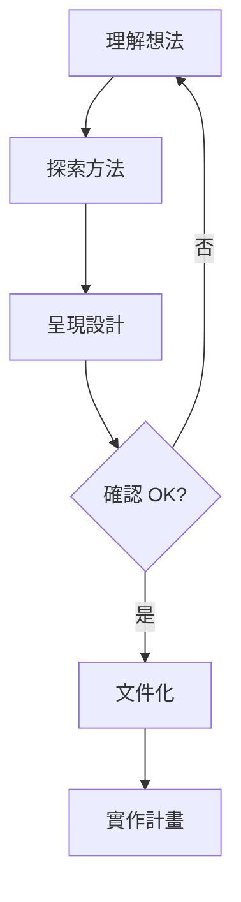
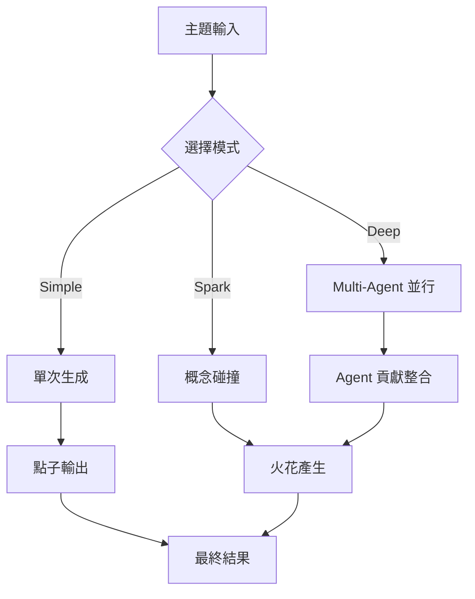

# 競品深度分析：obra/brainstorming

> **「核心競品」** - 與 CGU 同樣聚焦於創意發想，但採用完全不同的設計哲學

---

## 📊 基本資訊

| 屬性 | 值 |
|------|-----|
| **作者** | obra |
| **Stars** | 8,536 ⭐ |
| **Forks** | 709 |
| **來源** | [obra/superpowers](https://github.com/obra/superpowers) |
| **最後更新** | 2 個月前（v3.4.0 簡化版） |
| **月活躍度** | 5,757 次使用（過去 30 天） |

---

## 🎯 設計哲學對比

### brainstorming 的核心理念

```
Use when creating or developing, before writing code or implementation plans - 
refines rough ideas into fully-formed designs through collaborative questioning, 
alternative exploration, and incremental validation. 
Don't use during clear 'mechanical' processes
```

**關鍵特徵：**
1. **蘇格拉底式對話** - 透過提問引導設計
2. **協作式探索** - 人類與 AI 共同發展想法
3. **漸進式驗證** - 每個段落都確認後才繼續
4. **輕量化** - v3.4.0 刻意移除了重量級流程

### CGU 的核心理念

```
Multi-Agent 並行腦力激盪 + 概念碰撞產生火花
```

**關鍵特徵：**
1. **Multi-Agent 架構** - Explorer/Critic/Wildcard 並行思考
2. **概念碰撞** - 讓低關聯概念產生意外火花
3. **深度思考** - shallow/medium/deep 三種深度
4. **工具導向** - 提供 10+ 種創意方法

---

## 🔄 工作流程對比

### brainstorming 流程（v3.4.0 簡化版）



**詳細步驟：**

#### Phase 1: Understanding the Idea
- 先查看專案狀態（files, docs, commits）
- **一次只問一個問題** ← 這是核心原則
- 偏好選擇題，但開放式也可以
- 聚焦：目的、限制、成功標準

#### Phase 2: Exploring Approaches  
- 提出 2-3 個不同方案與權衡
- **以對話方式呈現，帶有推薦與理由**
- 領先展示推薦選項並解釋原因

#### Phase 3: Presenting the Design
- 將設計拆成 **200-300 字小節**
- 每節後詢問是否正確
- 涵蓋：架構、組件、資料流、錯誤處理、測試

#### Phase 4: After the Design
- 寫入 `docs/plans/YYYY-MM-DD-<topic>-design.md`
- 使用 `writing-clearly-and-concisely` skill
- 使用 `using-git-worktrees` 建立獨立工作區
- 使用 `writing-plans` 建立實作計畫

### CGU 流程



---

## 💡 關鍵原則對比

| 原則 | brainstorming | CGU |
|------|---------------|-----|
| **互動模式** | 一次一問（Socratic） | 批次生成（Batch） |
| **探索方式** | 提案 2-3 選項 | Multi-Agent 平行 |
| **驗證機制** | 每段落確認 | 驚喜度評分 |
| **輸出格式** | 設計文件 | 點子列表 + 火花 |
| **YAGNI** | 嚴格執行 | 鼓勵探索 |
| **彈性** | 可回溯釐清 | 深度可調 |

---

## 🏗️ 架構對比

### brainstorming 架構（單一 SKILL.md）

```
skills/brainstorming/
└── SKILL.md (54 lines, ~500 words)
```

**特點：**
- 極度簡化（v3.4.0 移除 6-phase 流程）
- 純對話指引，無程式碼
- 依賴其他 skills（writing-plans, using-git-worktrees）

### CGU 架構（完整 MCP Server）

```
cgu/
├── server.py          # MCP 伺服器
├── engine/
│   ├── llm_interface.py
│   ├── thinking_engine.py
│   └── ollama_engine.py
├── creativity/
│   ├── idea_generator.py
│   └── collision_engine.py
└── methods/
    └── 10+ 創意方法
```

**特點：**
- 完整的 Python 套件
- MCP Server 可獨立運行
- 多種 LLM 後端支援
- 可程式化 API

---

## 📈 演進歷史（brainstorming）

| 版本 | 日期 | 變更 |
|------|------|------|
| v3.4.0 | 2025-10-30 | **大幅簡化**：移除 6-phase 流程，回歸對話本質 |
| v3.3.1 | 2025-10-28 | 自主偵察、推薦驅動決策、防止委託回人類 |
| v3.1.0 | 2025-10-17 | 新增 Quick Reference、checklist、flowchart |

**重要洞察：**
> v3.4.0 刻意「去流程化」，說明作者認為過度結構化反而阻礙創意

---

## ⚔️ 競爭力分析

### brainstorming 的優勢

1. **簡單** - 54 行就能運作
2. **整合** - 與 superpowers 生態系無縫協作
3. **人性化** - 蘇格拉底式對話更自然
4. **社群** - 8,500+ stars，活躍維護
5. **實戰驗證** - 來自真實工作流程

### brainstorming 的劣勢

1. **依賴人類** - 需要人類持續回答問題
2. **單一視角** - 沒有 Multi-Agent 多元觀點
3. **缺乏驚喜** - 沒有概念碰撞機制
4. **無法量化** - 沒有創意度評分

### CGU 的優勢

1. **自主性** - 可獨立運行產生多個點子
2. **多元性** - Multi-Agent 平行思考
3. **驚喜性** - 概念碰撞產生意外連結
4. **可量化** - 創意層級、驚喜度評分
5. **方法論** - 10+ 種結構化創意技法

### CGU 的劣勢

1. **複雜** - 需要更多設定
2. **獨立** - 不在 superpowers 生態系內
3. **較新** - 社群基礎尚小
4. **批次** - 不如對話式自然

---

## 🎯 差異化定位

```
               低互動                              高互動
                 │                                  │
                 ▼                                  ▼
    ┌────────────────────────────────────────────────────┐
    │                                                    │
    │   CGU                           brainstorming     │
    │   ████████                              ████████  │
    │   批次生成                              對話探索   │
    │   多Agent                               單一指引   │
    │   概念碰撞                              漸進驗證   │
    │                                                    │
    └────────────────────────────────────────────────────┘
                 ▲                                  ▲
                 │                                  │
            自主發散                            協作收斂
```

---

## 💡 可借鏡之處

### 1. 簡化是進化

> v3.4.0 的教訓：**過度結構化反而阻礙創意**

**CGU 可考慮：**
- 提供「極簡模式」只輸出核心點子
- 減少必填參數，增加智能預設

### 2. 一次一問的魔力

> **One question at a time** - Don't overwhelm with multiple questions

**CGU 可考慮：**
- 新增「互動模式」逐步引導
- `generate_ideas` 可加 `interactive=True` 選項

### 3. YAGNI 精神

> **YAGNI ruthlessly** - Remove unnecessary features from all designs

**CGU 可考慮：**
- 方法選擇加入「最小可用」原則
- 預設推薦最簡單的有效方法

### 4. 推薦驅動

> **Lead with your recommended option** and explain why

**CGU 可考慮：**
- 結果輸出加入「推薦」標記
- 自動排序並解釋為何推薦

---

## 🔮 策略建議

### 短期（v0.4.0）

1. **互補定位** - CGU 專注「批次發散」，不與 brainstorming 直接競爭
2. **極簡模式** - 新增 `quick=True` 快速出點子
3. **推薦機制** - 結果加入 AI 推薦與理由

### 中期（v0.5.0）

1. **對話模式** - 新增 `interactive_brainstorm()` 蘇格拉底式
2. **生態整合** - 考慮成為 superpowers 的擴展 skill
3. **設計輸出** - 新增 `export_design_doc()` 產生設計文件

### 長期

1. **混合模式** - 結合 CGU 發散 + brainstorming 收斂
2. **Workflow** - 提供完整的「想法→設計→計畫」流程
3. **社群** - 投入 superpowers 社群建立關係

---

## 📚 完整 SKILL.md 內容

<details>
<summary>點擊展開完整內容</summary>

```markdown
---
name: brainstorming
description: Use when creating or developing, before writing code or implementation plans - refines rough ideas into fully-formed designs through collaborative questioning, alternative exploration, and incremental validation. Don't use during clear 'mechanical' processes
---

# Brainstorming Ideas Into Designs

## Overview

Help turn ideas into fully formed designs and specs through natural collaborative dialogue.

Start by understanding the current project context, then ask questions one at a time to refine the idea. Once you understand what you're building, present the design in small sections (200-300 words), checking after each section whether it looks right so far.

## The Process

**Understanding the idea:**
- Check out the current project state first (files, docs, recent commits)
- Ask questions one at a time to refine the idea
- Prefer multiple choice questions when possible, but open-ended is fine too
- Only one question per message - if a topic needs more exploration, break it into multiple questions
- Focus on understanding: purpose, constraints, success criteria

**Exploring approaches:**
- Propose 2-3 different approaches with trade-offs
- Present options conversationally with your recommendation and reasoning
- Lead with your recommended option and explain why

**Presenting the design:**
- Once you believe you understand what you're building, present the design
- Break it into sections of 200-300 words
- Ask after each section whether it looks right so far
- Cover: architecture, components, data flow, error handling, testing
- Be ready to go back and clarify if something doesn't make sense

## After the Design

**Documentation:**
- Write the validated design to `docs/plans/YYYY-MM-DD-<topic>-design.md`
- Use elements-of-style:writing-clearly-and-concisely skill if available
- Commit the design document to git

**Implementation (if continuing):**
- Ask: "Ready to set up for implementation?"
- Use superpowers:using-git-worktrees to create isolated workspace
- Use superpowers:writing-plans to create detailed implementation plan

## Key Principles

- **One question at a time** - Don't overwhelm with multiple questions
- **Multiple choice preferred** - Easier to answer than open-ended when possible
- **YAGNI ruthlessly** - Remove unnecessary features from all designs
- **Explore alternatives** - Always propose 2-3 approaches before settling
- **Incremental validation** - Present design in sections, validate each
- **Be flexible** - Go back and clarify when something doesn't make sense
```

</details>

---

## 🏆 結論

**brainstorming 和 CGU 是互補而非競爭關係：**

| 場景 | 推薦工具 |
|------|----------|
| 需要快速發散多個點子 | **CGU** |
| 需要深入探索單一想法 | **brainstorming** |
| 需要多元視角碰撞 | **CGU** (Multi-Agent) |
| 需要與人類協作驗證 | **brainstorming** |
| 需要結構化創意方法 | **CGU** (SCAMPER, 六頂帽等) |
| 需要產出設計文件 | **brainstorming** + writing-plans |

**最佳實踐：CGU 發散 → brainstorming 收斂 → writing-plans 實作**

---

*最後更新：2026-01-08*
*分析版本：brainstorming v3.4.0 vs CGU v0.4.0*

---

# 📚 延伸競品分析：Agent Skills Template Repos

> **調研日期**: 2026-01-08
> **目的**: 從優秀的 template repos 學習 skills 設計模式，發想 CGU 可新增的 skills

---

## 🔥 參考 Repos 摘要

| Repo | Stars | 核心特色 | 價值 |
|------|-------|----------|------|
| [obra/superpowers](https://github.com/obra/superpowers) | 8,500+ | 核心技能庫（TDD、除錯、協作） | 🏆 生態系標準 |
| [Agent-Skills-for-Context-Engineering](https://github.com/muratcankoylan/Agent-Skills-for-Context-Engineering) | - | Context Engineering 專用技能 | 理論+實踐 |
| [claude-scientific-skills](https://github.com/K-Dense-AI/claude-scientific-skills) | - | 100+ 科學研究技能 | 領域專精範例 |
| [claude-code-showcase](https://github.com/ChrisWiles/claude-code-showcase) | - | 完整 .claude/ 目錄結構範例 | 配置最佳實踐 |
| [awesome-agent-skills](https://github.com/heilcheng/awesome-agent-skills) | - | 技能彙整列表 | 發現資源 |
| [Skill_Seekers](https://github.com/yusufkaraaslan/Skill_Seekers) | - | 自動將文檔轉成 Skills | 工具化 |

---

## 🏗️ obra/superpowers 技能清單

> **標準生態系** - CGU 可直接整合或參考

### 測試類
- `test-driven-development` - RED-GREEN-REFACTOR 循環

### 除錯類
- `systematic-debugging` - 4 階段根因分析
- `verification-before-completion` - 確認修復

### 協作類
- `brainstorming` - 蘇格拉底式設計
- `writing-plans` - 詳細實作計畫
- `executing-plans` - 批次執行 + checkpoints
- `dispatching-parallel-agents` - 子 Agent 並行
- `requesting-code-review` - 請求 code review
- `receiving-code-review` - 回應 code review
- `using-git-worktrees` - 平行開發分支
- `finishing-a-development-branch` - 合併/PR 決策
- `subagent-driven-development` - 兩階段審查

### Meta
- `writing-skills` - 撰寫新 skills
- `using-superpowers` - 系統介紹

---

## 🧠 Agent-Skills-for-Context-Engineering 技能分類

### Foundational Skills（基礎）
- `context-fundamentals` - Context 基礎概念
- `context-degradation` - Context 退化處理
- `context-compression` - Context 壓縮技術

### Architectural Skills（架構）
- `multi-agent-patterns` - 多 Agent 模式
- `memory-systems` - 記憶系統設計
- `tool-design` - 工具設計
- `filesystem-context` - 檔案系統 context

### Operational Skills（運營）
- `context-optimization` - Context 優化
- `evaluation` - 評估方法
- `advanced-evaluation` - 進階評估

### Development Methodology（開發方法）
- `project-development` - 專案開發方法論

### Cognitive Architecture（認知架構）
- `bdi-mental-states` - BDI 心智模型

---

## 🔬 claude-scientific-skills 技能類別

> **科學研究專精** - 100+ skills 分類

| 類別 | 技能數 | 重點 |
|------|--------|------|
| Bioinformatics & Genomics | 16+ | BioPython, Scanpy, AnnData |
| Cheminformatics & Drug Discovery | 10+ | RDKit, DeepChem, DiffDock |
| Clinical Research | 12+ | ClinVar, PyHealth |
| Machine Learning & AI | 15+ | PyTorch, Transformers, SHAP |
| Data Analysis & Visualization | 14+ | Matplotlib, Plotly, NetworkX |
| Scientific Communication | 20+ | PubMed, bioRxiv, LaTeX |
| Scientific Databases | 28+ | UniProt, PDB, PubChem |

---

## 📁 claude-code-showcase 目錄結構

```
.claude/
├── settings.json           # Hooks, 環境, 權限
├── settings.local.json     # 個人覆蓋 (gitignored)
├── settings.md             # Hook 文件
├── agents/                 # 自訂 AI agents
│   └── code-reviewer.md
├── commands/               # Slash commands (/command)
│   ├── onboard.md          # 深入任務探索
│   ├── pr-review.md        # PR 審查流程
│   ├── pr-summary.md       # 生成 PR 描述
│   ├── code-quality.md     # 品質檢查
│   └── docs-sync.md        # 文件同步
├── hooks/                  # Hook scripts
│   ├── skill-eval.sh       # 技能匹配
│   ├── skill-eval.js       # 匹配引擎
│   └── skill-rules.json    # 匹配規則
├── skills/                 # 領域知識
│   ├── testing-patterns/
│   ├── systematic-debugging/
│   ├── react-ui-patterns/
│   ├── graphql-schema/
│   └── core-components/
└── rules/                  # 模組化指令
    ├── code-style.md
    └── security.md
```

---

## 💡 CGU Skill 發想

### 現有 Skills (14 個)

| Skill | 類別 | 狀態 |
|-------|------|------|
| `changelog-updater` | 文件 | ✅ |
| `code-refactor` | 開發 | ✅ |
| `code-reviewer` | 開發 | ✅ |
| `creative-ideation` | 創意 | ✅ |
| `ddd-architect` | 架構 | ✅ |
| `git-doc-updater` | Git | ✅ |
| `git-precommit` | Git | ✅ |
| `memory-checkpoint` | Memory | ✅ |
| `memory-updater` | Memory | ✅ |
| `project-init` | 專案 | ✅ |
| `readme-i18n` | 文件 | ✅ |
| `readme-updater` | 文件 | ✅ |
| `roadmap-updater` | 文件 | ✅ |
| `test-generator` | 測試 | ✅ |

---

### 🆕 建議新增 Skills

#### 優先級 1: 與 CGU 核心相關

| Skill | 描述 | 參考來源 |
|-------|------|----------|
| `spark-collision` | 概念碰撞創意產生 | CGU v0.4 |
| `multi-agent-brainstorm` | Multi-Agent 協作腦力激盪 | CGU + superpowers |
| `idea-evolution` | 想法演化與迭代 | CGU v0.4 tools |
| `novelty-checker` | 新穎度評估與驗證 | CGU v0.4 tools |

#### 優先級 2: 整合 superpowers 生態

| Skill | 描述 | 參考來源 |
|-------|------|----------|
| `writing-plans` | 詳細實作計畫撰寫 | superpowers |
| `executing-plans` | 批次執行 + checkpoints | superpowers |
| `systematic-debugging` | 4 階段根因分析 | superpowers |
| `dispatching-parallel-agents` | 子 Agent 並行派遣 | superpowers |

#### 優先級 3: Context Engineering

| Skill | 描述 | 參考來源 |
|-------|------|----------|
| `context-compression` | 長 context 壓縮 | Agent-Skills |
| `memory-systems` | 進階記憶系統 | Agent-Skills |
| `multi-agent-patterns` | 多 Agent 協調模式 | Agent-Skills |

#### 優先級 4: 研究相關

| Skill | 描述 | 參考來源 |
|-------|------|----------|
| `literature-review` | 文獻回顧輔助 | claude-scientific |
| `hypothesis-generation` | 假設生成 | claude-scientific |
| `research-brainstorming` | 研究主題腦力激盪 | claude-scientific |

---

### 🗺️ Skill 架構規劃

```
.claude/skills/
├── core/                    # 核心通用
│   ├── memory-updater/
│   ├── memory-checkpoint/
│   └── project-init/
│
├── creativity/              # 創意發想 (CGU 專長)
│   ├── creative-ideation/
│   ├── spark-collision/       # NEW
│   ├── multi-agent-brainstorm/ # NEW
│   ├── idea-evolution/        # NEW
│   └── novelty-checker/       # NEW
│
├── development/             # 開發相關
│   ├── code-refactor/
│   ├── code-reviewer/
│   ├── test-generator/
│   ├── ddd-architect/
│   ├── systematic-debugging/  # NEW (from superpowers)
│   └── writing-plans/         # NEW (from superpowers)
│
├── git/                     # Git 工作流
│   ├── git-precommit/
│   └── git-doc-updater/
│
├── documentation/           # 文件更新
│   ├── changelog-updater/
│   ├── readme-updater/
│   ├── readme-i18n/
│   └── roadmap-updater/
│
└── research/                # 研究相關 (NEW)
    ├── literature-review/     # NEW
    ├── hypothesis-generation/ # NEW
    └── research-brainstorming/ # NEW
```

---

## 🎯 行動計畫

### Phase 1: 整合現有 (v0.5.0)
- [ ] 將 creativity skills 移到 `.claude/skills/creativity/`
- [ ] 建立 skill 目錄結構
- [ ] 新增 `spark-collision` skill (基於 CGU v0.4 tools)

### Phase 2: 擴展生態 (v0.6.0)  
- [ ] 從 superpowers 移植 `writing-plans`
- [ ] 從 superpowers 移植 `systematic-debugging`
- [ ] 建立 skills README 索引

### Phase 3: 研究專精 (v0.7.0)
- [ ] 新增研究相關 skills
- [ ] 整合 claude-scientific-skills 參考

---

## 📚 延伸閱讀

- [obra/superpowers](https://github.com/obra/superpowers) - 標準生態系
- [Agent-Skills-for-Context-Engineering](https://github.com/muratcankoylan/Agent-Skills-for-Context-Engineering) - Context 專精
- [claude-scientific-skills](https://github.com/K-Dense-AI/claude-scientific-skills) - 科學研究
- [claude-code-showcase](https://github.com/ChrisWiles/claude-code-showcase) - 配置範例
- [awesome-agent-skills](https://github.com/heilcheng/awesome-agent-skills) - 資源彙整
